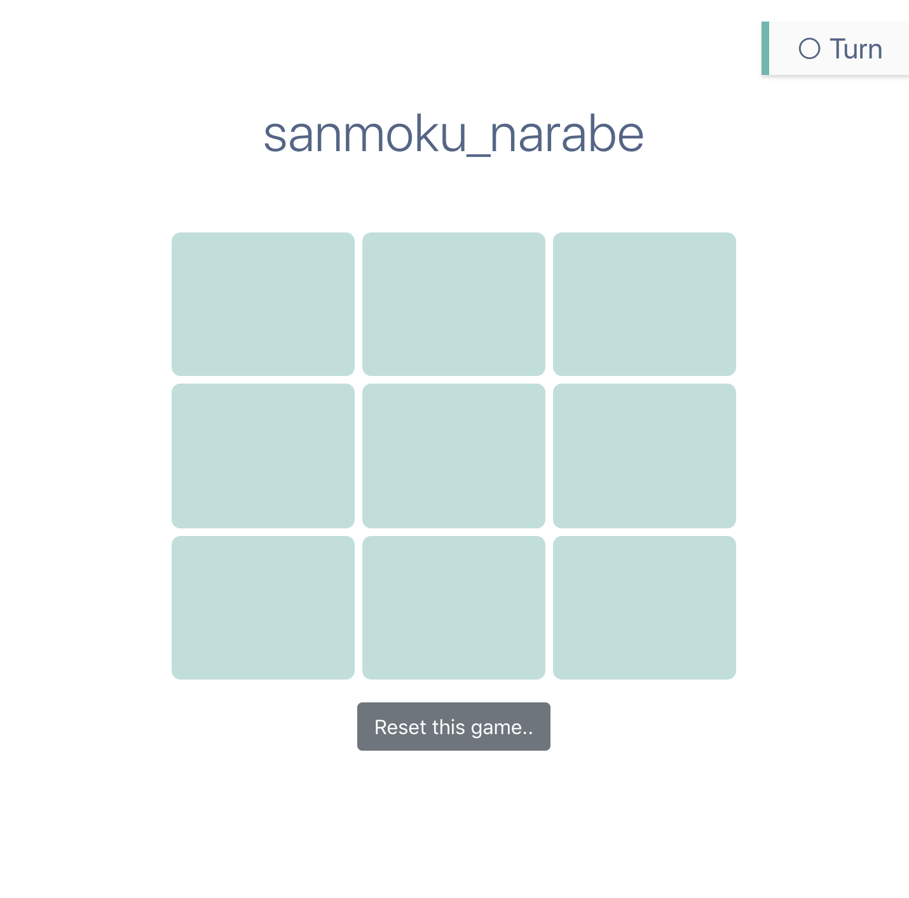

# sanmoku_narabe

Nuxtのまるばつゲーム

url: https://nari19.github.io/sanmoku_narabe/





> My groovy Nuxt.js project

## Build Setup

``` bash
# install dependencies
$ npm run install

# serve with hot reload at localhost:3000
$ npm run dev

# build for production and launch server
$ npm run build
$ npm run start

# generate static project
$ npm run generate

# gh-pagesブランチに自動的にdistファイルをコミット&プッシュ
# https://upd.world/nuxtjs-deploy-gh-pages/
$ npm run deploy
```

For detailed explanation on how things work, checkout [Nuxt.js docs](https://nuxtjs.org).